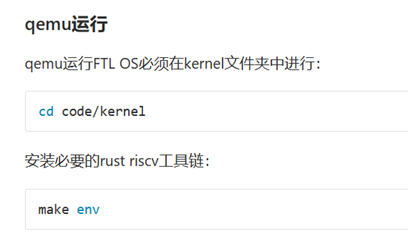
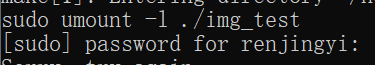
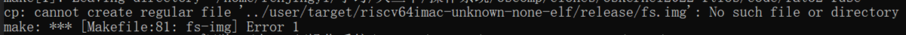
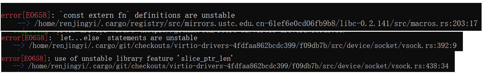
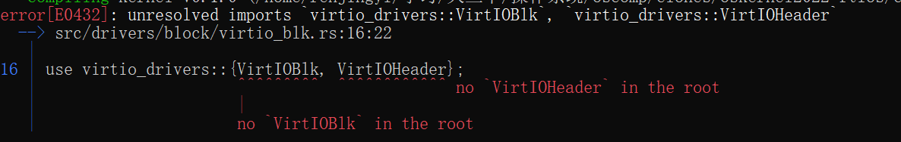
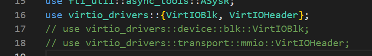
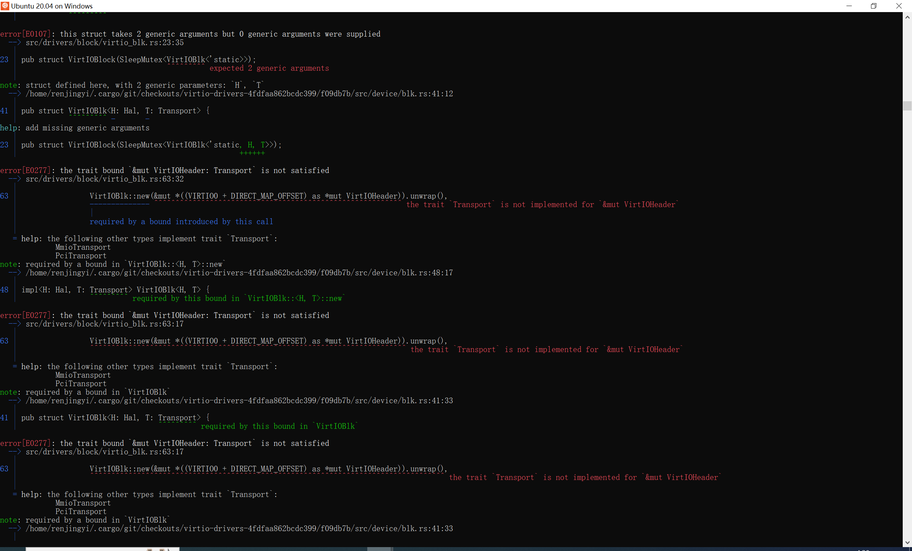
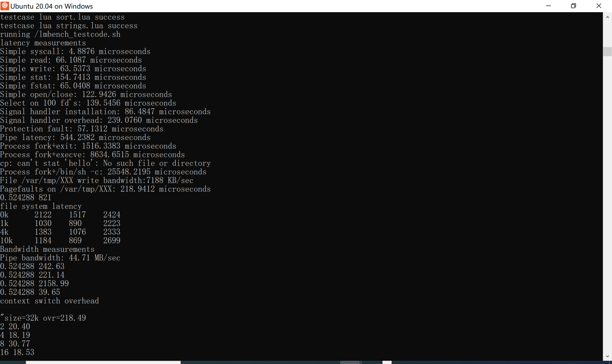
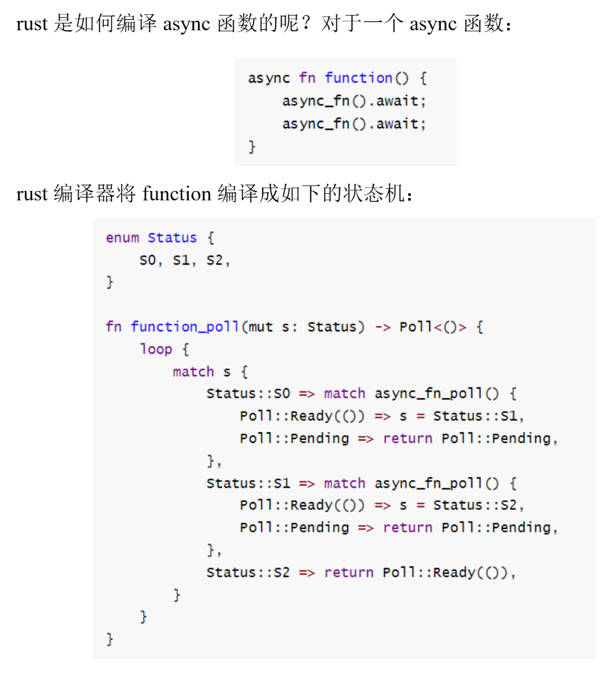

# 4.16 进展汇报
## 本周工作
- 编写用户态框架，编写用户库，目前已经可以支持 rCore ch2 同等级别的用户程序(支持 sys_write 和 sys_exit 两个系统调用)
- 阅读并运行去年哈工大一等奖作品 FTLOS，做简要分析

### 用户态
三方面进展：用户库的改进，用户态的设置，syscall 的处理 

部分参考了 rCore-Tutorial，蒋昊迪 同学和其他 SRT-OS 同学的工作

**用户库改进**

原来的用户库不支持 syscall 系统调用，需要手动添加(由于 c 语言的交叉编译比较复杂，目前只支持了 rust，后续会继续向 c 推进)
```rust
// ulib/syscall/mod.rs
pub mod process;

use process::*;

pub fn write_str(s: &str) {
    sys_write(1, s.as_bytes());
}

pub fn exit(exit_code: i32) -> ! {
    sys_exit(exit_code);
}
```
```rust
// ulib/syscall/process.rs

pub const SYSCALL_WRITE: usize = 64;
pub const SYSCALL_EXIT: usize = 93;

pub fn syscall(id: usize, args: [usize; 3]) -> isize {
    let mut ret: isize;
    unsafe {
        core::arch::asm!(
            "ecall",
            inlateout("x10") args[0] => ret,
            in("x11") args[1],
            in("x12") args[2],
            in("x17") id
        );
    }
    ret
}

pub fn sys_write(fd: usize, buffer: &[u8]) -> isize {
    syscall(SYSCALL_WRITE, [fd, buffer.as_ptr() as usize, buffer.len()])
}

pub fn sys_exit(exit_code: i32) -> ! {
    syscall(SYSCALL_EXIT, [exit_code as usize, 0, 0]);
    panic!("sys_exit never returns!");
}
```
模仿 rCore-Tutorial 的格式封装 syscall，并将其进一步封装成对用户友好的形式，新建一个用户程序 my_test：
```rust
// apps/my_test/src/main.rs
#![no_std]
#![no_main]

#[no_mangle]

fn main() {
    libax::write_str("test sys_write success!\n");
    libax::exit(0);
}
```
预期运行结果：
```text
...
test sys_write success!
```

**用户态设置**

arceos 是 unikernel 架构，在本来的设定中用户程序和内核都在 S 态运行，而比赛需要用户态和内核态的分离，即用户程序运行在 U 态，通过 syscall 陷入 S 态，内核在 S 态处理完 syscall 后返回 U 态并将控制流还原到用户程序。

为了实现这种结构，首先需要让用户程序能够在 U 态运行，这不仅仅需要设置 sstatus 的状态，还需要设置 trap 上下文使得 syscall 能够正确陷入和返回，进而还要设置分离的内核栈和用户栈。

刚开始做的时候一头雾水，幸好 rCore-Tutorial 的 ch2 实现的正是这样一个简单的批处理系统，将其搬过来插入到合适的位置就可以实现最简单的用户态了，中间有很多疑惑不解的地方和同学、助教学长交流之后也得到了解决

按程序运行时的顺序展示代码，内核的入口是 rust_main，经过一系列初始化后本来会调用用户程序的 main() 函数，现在改为调用自己编写的 naive_main()
```rust
// modules/axruntime/src/lib.rs
pub extern "C" fn rust_main(cpu_id: usize, dtb: usize) -> ! {
    ...
    while !is_init_ok() {
        core::hint::spin_loop();
    }

    // unsafe { main() };
    naive::naive_main();

    axtask::exit(0)
}
```
naive_main() 中包含了初始化用户栈内核栈的内容，并将唯一的用户程序设置好 trap 上下文压入到内核栈中，最后进入 U 态开始执行用户程序，用户栈内核栈的设计来自 rCore-Tutorial
```rust
// modules/axruntime/src/naive.rs
use axhal::arch::TrapFrame;

const USER_STACK_SIZE: usize = 4096 * 2;
const KERNEL_STACK_SIZE: usize = 4096 * 2;

#[repr(align(4096))]
struct KernelStack {
    data: [u8; KERNEL_STACK_SIZE],
}

#[repr(align(4096))]
struct UserStack {
    data: [u8; USER_STACK_SIZE],
}

static KERNEL_STACK: KernelStack = KernelStack {
    data: [0; KERNEL_STACK_SIZE],
};
static USER_STACK: UserStack = UserStack {
    data: [0; USER_STACK_SIZE],
};

impl KernelStack {
    fn get_sp(&self) -> usize {
        self.data.as_ptr() as usize + KERNEL_STACK_SIZE
    }
    pub fn push_context(&self, cx: TrapFrame) -> &'static mut TrapFrame {
        let cx_ptr = (self.get_sp() - core::mem::size_of::<TrapFrame>()) as *mut TrapFrame;
        unsafe {
            *cx_ptr = cx;
        }
        unsafe { cx_ptr.as_mut().unwrap() }
    }
}

impl UserStack {
    fn get_sp(&self) -> usize {
        self.data.as_ptr() as usize + USER_STACK_SIZE
    }
}

pub fn naive_main() {
    extern "Rust" {
        fn main();
    }
    extern "C" {
        fn __start_first_app(frame_address: usize);
    }
    unsafe {
        __start_first_app(KERNEL_STACK.push_context(TrapFrame::app_init_context(
            main as usize,
            USER_STACK.get_sp(),
        )) as *const _ as usize);
    }
    panic!("Unreachable in batch::run_current_app!");
}
```
需要根据用户程序的入口和内核栈设置用户程序的 trap 上下文，TrapFrame 结构体已经实现了基本结构，只需要再模仿 rCore-Tutorial 写出初始化代码即可
```rust
// modules/axhal/src/arch/riscv/context.rs
impl TrapFrame {
    pub fn set_sp(&mut self, sp: usize) {
        self.regs.sp = sp;
    }
    /// init app context
    pub fn app_init_context(entry: usize, sp: usize) -> Self {
        // let mut sstatus = sstatus::read(); // CSR sstatus
        // sstatus.set_spp(SPP::User); //previous privilege mode: user mode
        let spp = sstatus::read().spp();
        unsafe { set_spp(SPP::User) }
        let sstatus = sstatus::read();
        unsafe { set_spp(spp) }

        let mut cx = Self {
            regs: GeneralRegisters::default(),
            sstatus: unsafe { *(&sstatus as *const Sstatus as *const usize) },
            sepc: entry, // entry point of app
        };
        cx.set_sp(sp); // app's user stack pointer
        cx // return initial Trap Context of app
    }
}
```
设置好用户程序的 trap 上下文后，需要把 pc 指针指向用户程序代码，并将权限改为 U，进入用户程序运行，已经写好的 trap.S 可以实现交换上下文，在此基础上实现一个新函数 __start_first_app，先将栈指针指向用户程序设置的上下文，然后交换上下文，最后通过 sret 进入 U 态并执行用户程序
```riscv
@ modules/axhal/src/arch/riscv/trap.S
.macro SAVE_REGS, from_user
    addi    sp, sp, -{trapframe_size}   
    PUSH_GENERAL_REGS        

    csrr    t0, sepc
    csrr    t1, sstatus
    csrrw   t2, sscratch, zero          // save sscratch (sp) and zero it
    STR     t0, sp, 31                  // tf.sepc
    STR     t1, sp, 32                  // tf.sstatus
    STR     t2, sp, 1                   // tf.regs.sp

.if \from_user == 1
    LDR     t0, sp, 3                   // load supervisor tp
    STR     gp, sp, 2                   // save user gp and tp
    STR     tp, sp, 3                   
    mv      tp, t0                      // mv rd rs
.endif
.endm

.macro RESTORE_REGS, from_user
.if \from_user == 1
    LDR     gp, sp, 2                   // load user gp and tp
    LDR     t0, sp, 3
    STR     tp, sp, 3                   // save supervisor tp
    mv      tp, t0
    addi    t0, sp, {trapframe_size}    // put supervisor sp to scratch
    csrw    sscratch, t0
.endif

    LDR     t0, sp, 31
    LDR     t1, sp, 32
    csrw    sepc, t0
    csrw    sstatus, t1

    POP_GENERAL_REGS
    LDR     sp, sp, 1                   // load sp from tf.regs.sp
.endm

.section .text
.balign 4
.global trap_vector_base
trap_vector_base:
    // sscratch == 0: trap from S mode
    // sscratch != 0: trap from U mode
    csrrw   sp, sscratch, sp            // switch sscratch and sp
    bnez    sp, .Ltrap_entry_u

    csrr    sp, sscratch                // put supervisor sp back
    j       .Ltrap_entry_s

.Ltrap_entry_s:
    SAVE_REGS 0
    mv      a0, sp
    li      a1, 0
    call    riscv_trap_handler
    RESTORE_REGS 0
    sret

.Ltrap_entry_u:
    SAVE_REGS 1
    mv      a0, sp
    li      a1, 1
    call    riscv_trap_handler
    RESTORE_REGS 1
    sret

.section .text
.balign 4
.global __start_first_app
__start_first_app:
    mv      sp, a0
    RESTORE_REGS 1
    sret
```

**syscall 处理**

设置好用户态后，最后的部分是处理用户程序主动发起的 syscall，为此需要在 trap 处理时检测到 ecall 并做相应处理，之前已经解决了 Breakpoint 和 Interrupt 的情况，在同样的地方判断 UserEnvCall 即可
```rust
// modules/axhal/src/arch/riscv/trap.rs
fn riscv_trap_handler(tf: &mut TrapFrame, _from_user: bool) {
    let scause = scause::read();
    match scause.cause() {
        Trap::Exception(E::Breakpoint) => handle_breakpoint(&mut tf.sepc),
        Trap::Interrupt(_) => crate::trap::handle_irq_extern(scause.bits()),
        
        Trap::Exception(E::UserEnvCall) => {
            tf.sepc += 4;
            tf.regs.a0 = crate::trap::syscall(tf.regs.a7, [tf.regs.a0, tf.regs.a1, tf.regs.a2]) as usize;
        }
        _ => {
            panic!(
                "Unhandled trap {:?} @ {:#x}:\n{:#x?}",
                scause.cause(),
                tf.sepc,
                tf
            );
        }
    }
}
```
模仿之前的代码，在 crate::trap::TrapHandler trait 中加入 syscall 函数，用和 handle_irq_extern 类似的方法运行
```rust
// modules/axhal/src/trap.rs
use crate_interface::{call_interface, def_interface};

#[def_interface]
pub trait TrapHandler {
    fn handle_irq(irq_num: usize);
    // more e.g.: handle_page_fault();

    fn syscall(syscall_id: usize, args: [usize; 3]) -> isize;
}

/// Call the external IRQ handler.
#[allow(dead_code)]
pub(crate) fn handle_irq_extern(irq_num: usize) {
    call_interface!(TrapHandler::handle_irq, irq_num);
}

#[allow(dead_code)]
pub(crate) fn syscall(syscall_id: usize, args: [usize; 3]) -> isize {
    call_interface!(TrapHandler::syscall, syscall_id, args)
}
```
继续追踪代码，发现这个 trait 在 axruntime::trap 中被实现
```rust
// modules/axruntime/src/trap.rs
struct TrapHandlerImpl;

#[crate_interface::impl_interface]
impl axhal::trap::TrapHandler for TrapHandlerImpl {
    fn handle_irq(irq_num: usize) {
        let guard = kernel_guard::NoPreempt::new();
        axhal::irq::dispatch_irq(irq_num);
        drop(guard); // rescheduling may occur when preemption is re-enabled.
    }
    fn syscall(syscall_id: usize, args: [usize; 3]) -> isize {
        crate::syscall::syscall(syscall_id, args)
    }
}
```
在同模块下添加 syscall 模块，用来处理所有的系统调用，按照 rCore-Tutorial 的格式对 syscall 分类处理
```rust
// modules/axruntime/src/syscall/mod.rs
...
/// write syscall
const SYSCALL_WRITE: usize = 64;
/// exit syscall
const SYSCALL_EXIT: usize = 93;

mod fs;
mod process;

use fs::*;
use process::*;
/// handle syscall exception with `syscall_id` and other arguments
pub fn syscall(syscall_id: usize, args: [usize; 3]) -> isize {
    match syscall_id {
        SYSCALL_WRITE => sys_write(args[0], args[1] as *const u8, args[2]),
        SYSCALL_EXIT => sys_exit(args[0] as i32),
        _ => panic!("Unsupported syscall_id: {}", syscall_id),
    }
}
```
对于 sys_exit，直接调用 axtask::exit (目前只有一个进程所以没有问题，之后肯定要修改)
```rust
// modules/axruntime/src/syscall/process.rs
/// task exits and submit an exit code
pub fn sys_exit(exit_code: i32) -> ! {
    axtask::exit(0);
}
```
对于 sys_write，将本来的 print! 换成 arceos 的 ax_print! 即可
```rust
// modules/axruntime/src/syscall/fs.rs
//! File and filesystem-related syscalls

const FD_STDOUT: usize = 1;

/// write buf of length `len`  to a file with `fd`
pub fn sys_write(fd: usize, buf: *const u8, len: usize) -> isize {
    trace!("kernel: sys_write");
    match fd {
        FD_STDOUT => {
            let slice = unsafe { core::slice::from_raw_parts(buf, len) };
            let str = core::str::from_utf8(slice).unwrap();
            ax_print!("{}", str);
            len as isize
        }
        _ => {
            panic!("Unsupported fd in sys_write!");
        }
    }
}

```
至此就实现了全部的两个 syscall，未来可以在 axruntime/src/syscall 处继续扩展实现更多的 syscall，不过还需要多进程、多地址空间、文件系统的适配

**小结**

最开始对着代码瞅了几天啥都看不懂，也没什么头绪。后来将整个问题拆解为三部分，先写一个带有 syscall 的用户库，让其可以支持 helloworld，然后试图写用户态的初始化，预期在用户程序调用 syscall 时可以在 trap handler 中检测到 UserEnvCall 并挂掉，最后写 syscall 的实现让整个程序可以顺利运行。中间令人头秃的调试和漫长的递归学习给我留下了十分深刻的记忆
 
### 哈工大 FTL OS 分析
**困难重重的配环境之路**

按提示 make 时有些小瑕疵，不过问题不大


需要 sudo 权限，最好能在根目录下直接运行


缺少目录，第一次需要手动创建


他们的 OS 使用的很多依赖包直接用了最新版，但有些包经过一年的开发源代码发生了改变，导致现在再用最新版就会编译出错...

以上三个问题可以按编译器的错误信息在对应的库文件源代码中添加对应的属性解决，但仍有新的问题

发现编译出错，因为在现版本的库中没有这两个结构体了，经过搜索发现底层有两个同名结构体，试图修改引用路径

结果引发了更严重的错

解决方法：和助教交流，助教提出可以指定所用包的分支和版本，经过尝试采用了最老的版本，顺利编译通过


成功运行了决赛测例，需要比较长的时间


**整体结构**

FTL OS：risc-v 64 平台上的高性能多核异步宏内核操作系统

部分代码借鉴自 2021 年哈工大(深圳)一等奖作品 Ultra OS、rCore-Tutorial、rCore，而 Ultra OS 基于 rCore-Tutorial-v3

选择 rust 而不是 C 的原因：
- rust 在 no_std 情况下还可以使用 core 库，省去很多手写的内容
- rust 提供基于模式匹配的错误处理，过程流畅
- rust 有基于所有权的析构函数，所有权转移后不会调用析构函数(C++ 的析构函数必定执行)
- 基于 trait 的泛型机制，强大的类型匹配系统
- 基于模块的编译，函数显式声明为 inline 后在所有编译单元中可见
- 不使用 unsafe 能够保证内存绝对安全
- 完善的包管理工具，通过版本号可以保证编译稳定性

无栈异步架构：灵感来源于 2021 年功能赛道二等奖作品飓风内核(华中科技大学)和 rCore，使用运行在用户态的共享调度器完成调度，上下文切换速度极快

有栈协程需要为每个任务分配一个栈空间，要么空间浪费要么栈溢出，无栈协程程序运行时需要的内存大小在编译器确定，分配任务时一次性分配内存，任务运行时不会出现空间不足或空间过剩

协程：在用户态模拟多线程的一种方式，上下文没有操作系统介入，上下文切换完全在用户态进行，协程是用户程序的一部分，完全由开发者控制，不像操作系统一样需要抢占式调度，而可以用更高效的协作式调度

有栈协程：通过调用新韩淑的方法切换上下文，可以插入至程序任意位置，但每个上下文都需要分配独立的栈空间，而函数的调用深度无法确定，容易浪费或溢出，每次函数返回还会造成分支预测失败

无栈协程：通过函数返回的方式离开当前函数上下文，切换上下文时依次退出函数直到回到调度器，但数据依然保存在堆上，调度器执行另一个函数时根据堆上信息重新生成调用栈



async_fn_poll 上下文返回的过程就是普通的函数返回，不需要进行栈的切换，不需要改变寄存器。无栈协程的切换速度远高于有栈协程，速度甚至可以达到 4 倍以上

内核快速处理路径：无栈上下文切换进出用户态还需要额外保存 callee saved 寄存器，所以用户态-内核态切换速度会比有栈上下文更慢，为了解决这个问题可以给每个线程分配一个“快速路径栈”，从用户态进入陷阱(trap)时会先进入快速处理路径，如果快速处理路径可以完成处理将直接回到用户态，如果无法处理将回到异步上下文。使用快速处理路径没有额外的寄存器开销，对于 getpid 等系统调用可以避免大量不必要的 callee saved 寄存器加载与保存
```rust
// kernel/src/syscall/fast/mod.rs
/// 返回Err的时候进入async路径
type Entry = Option<fn(&mut Syscall<'static>) -> SysRet>;
static FAST_SYSCALL_TABLE: [Entry; SYSCALL_MAX] = fast_syscall_generate();

const fn fast_syscall_generate() -> [Entry; SYSCALL_MAX] {
    let mut table: [Entry; SYSCALL_MAX] = [None; SYSCALL_MAX];
    table[SYSCALL_DUP] = Some(Syscall::sys_dup);
    table[SYSCALL_OPENAT] = Some(Syscall::sys_openat_fast);
    table[SYSCALL_CLOSE] = Some(Syscall::sys_close);
    table[SYSCALL_READ] = Some(Syscall::sys_read_fast);
    table[SYSCALL_WRITE] = Some(Syscall::sys_write_fast);
    table[SYSCALL_PSELECT6] = Some(Syscall::sys_pselect6_fast);
    table[SYSCALL_NEWFSTATAT] = Some(Syscall::sys_newfstatat_fast);
    table[SYSCALL_FSTAT] = Some(Syscall::sys_fstat_fast);
    table[SYSCALL_CLOCK_GETTIME] = Some(Syscall::sys_clock_gettime_fast);
    table[SYSCALL_KILL] = Some(Syscall::sys_kill);
    table[SYSCALL_RT_SIGACTION] = Some(Syscall::sys_rt_sigaction_fast);
    table[SYSCALL_GETRUSAGE] = Some(Syscall::sys_getrusage_fast);
    table[SYSCALL_GETPID] = Some(Syscall::sys_getpid);
    table[SYSCALL_GETPPID] = Some(Syscall::sys_getppid);
    table
}

/// UKContext 中包含 to_executor 标志, 并初始化为 1
pub unsafe fn running_syscall(cx: *mut UKContext) {
    let f = match FAST_SYSCALL_TABLE.get((*cx).a7()).copied() {
        Some(Some(f)) => f,
        Some(None) | None => return,
    };
    ...
}
```
```rust
// kernel/src/syscall/mod.rs
pub struct Syscall<'a> {
    cx: &'a mut UKContext,
    thread: &'a Thread,
    process: &'a Process,
    do_exit: bool,
}

impl<'a> Syscall<'a> {
    ...
    /// return do_exit
    #[inline(always)]
    pub async fn syscall(&mut self) -> bool {
        stack_trace!();
        self.cx.set_next_instruction();
        let result: SysRet = match self.cx.a7() {
            SYSCALL_GETCWD => self.sys_getcwd().await,
            SYSCALL_DUP => self.sys_dup(),
            SYSCALL_DUP3 => self.sys_dup3(),
            SYSCALL_FCNTL => self.sys_fcntl(),
            SYSCALL_IOCTL => self.sys_ioctl(),
            SYSCALL_MKDIRAT => self.sys_mkdirat().await,
            SYSCALL_UNLINKAT => self.sys_unlinkat().await,
            SYSCALL_UMOUNT2 => self.sys_umount2().await,
            SYSCALL_MOUNT => self.sys_mount().await,
            SYSCALL_STATFS => self.sys_statfs().await,
            SYSCALL_FACCESSAT => self.sys_faccessat().await,
            SYSCALL_CHDIR => self.sys_chdir().await,
            SYSCALL_FCHOWN => self.sys_fchown(),
            SYSCALL_OPENAT => self.sys_openat().await,
            SYSCALL_CLOSE => self.sys_close(),
            SYSCALL_PIPE2 => self.sys_pipe2().await,
            ...
        }
    }
}
```
```rust
// kernel/src/syscall/fs/mod.rs
pub async fn sys_getcwd(&mut self) -> SysRet {
    stack_trace!();
    let (buf_in, len): (UserWritePtr<u8>, usize) = self.cx.into();
    if PRINT_SYSCALL_FS {
        println!("sys_getcwd");
    }
    if buf_in.is_null() {
        return Err(SysError::EINVAL);
    }
    let buf = UserCheck::new(self.process)
        .writable_slice(buf_in, len)
        .await?;
    let path = self.alive_then(|a| a.cwd.path_str());
    let cwd_len = path.iter().fold(0, |a, b| a + b.len() + 1) + 1;
    let cwd_len = cwd_len.max(2);
    if buf.len() <= cwd_len {
        return Err(SysError::ERANGE);
    }
    let buf = &mut *buf.access_mut();
    let mut buf = &mut buf[..cwd_len];
    if path.is_empty() {
        buf[0] = b'/';
        buf = &mut buf[1..];
    }
    for s in path {
        buf[0] = b'/';
        buf = &mut buf[1..];
        buf[..s.len()].copy_from_slice(s.as_bytes());
        buf = &mut buf[s.len()..];
    }
    debug_assert_eq!(buf.len(), 1);
    buf[0] = b'\0';
    Ok(buf_in.as_usize())
}
```
大概感觉就是特判了一些 syscall 进行更简单的处理

还有很多其他功能，比如特有的任务调度、进程管理、用户态数据访问、RCU(Read-Copy Update) 系统等

## 下周计划
- 继续实现更多的 syscall (写 syscall 不是难点，难点是改造内核)
- 修改 c_libax 用户库使之能运行 c 语言的比赛测例
- 多多和老师、同学、学长交流
